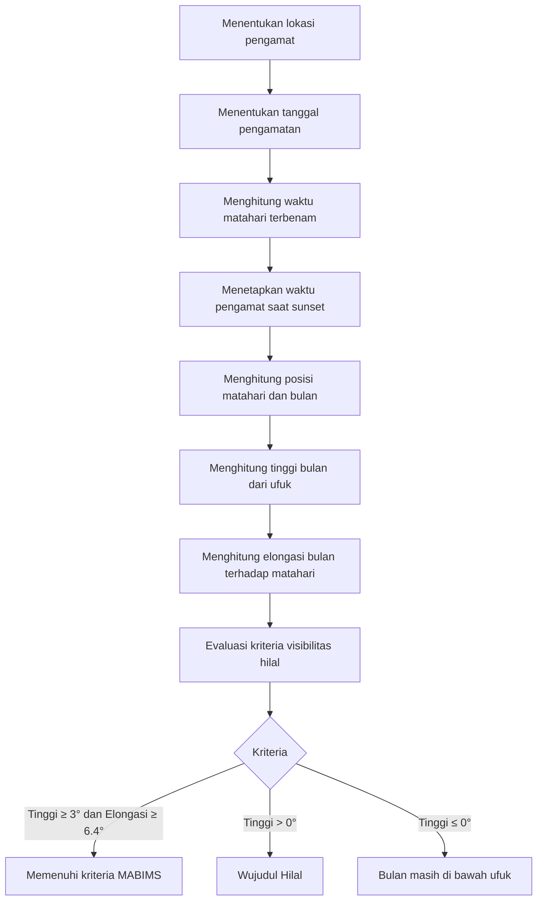

# Simulasi Hisab Hilal dengan PyEphem

Program Python untuk melakukan **simulasi perhitungan posisi hilal** menggunakan metode astronomi dengan library **PyEphem**.

Program ini menghitung posisi bulan saat **matahari terbenam (sunset)** pada lokasi dan tanggal tertentu, kemudian menampilkan:

* Tinggi hilal
* Elongasi bulan terhadap matahari
* Status visibilitas hilal berdasarkan kriteria **MABIMS**

---

# Fitur

* Menghitung waktu **matahari terbenam**
* Menghitung **tinggi hilal saat sunset**
* Menghitung **elongasi bulan terhadap matahari**
* Menentukan status visibilitas hilal
* Menggunakan koordinat lokasi pengamat
* Menggunakan pendekatan astronomi

---

# Persyaratan

Program ini membutuhkan Python dan library berikut:

* ephem

Install menggunakan pip:

```bash
pip install ephem
```

---

# Lokasi Pengamatan

Contoh kode menggunakan lokasi:

```
Kebumen, Jawa Tengah, Indonesia
Latitude  : -7.667808
Longitude : 109.656167
Elevation : 100 meter
```

Parameter tambahan untuk simulasi atmosfer:

* Temperature : 28°C
* Pressure : 1010 mBar

Parameter ini digunakan untuk meningkatkan akurasi **refraksi atmosfer di dekat ufuk**.

---

# Diagram Alur Perhitungan



---

# Cara Kerja Program

Program melakukan langkah berikut:

1. Mengatur lokasi pengamat menggunakan koordinat geografis
2. Menentukan tanggal pengamatan
3. Menghitung waktu matahari terbenam
4. Menghitung posisi bulan dan matahari pada waktu tersebut
5. Menghitung tinggi hilal dari ufuk
6. Menghitung elongasi bulan terhadap matahari
7. Menentukan status visibilitas hilal

---

# Kriteria Visibilitas Hilal

Penentuan status menggunakan pendekatan **kriteria MABIMS**.

| Kondisi                         | Status                   |
| ------------------------------- | ------------------------ |
| Tinggi ≥ 3° dan Elongasi ≥ 6.4° | Memenuhi kriteria MABIMS |
| Tinggi > 0°                     | Wujudul Hilal            |
| Tinggi ≤ 0°                     | Bulan di bawah ufuk      |

---

# Contoh Output

```
=== SIMULASI HISAB HILAL 2026 ===
Lokasi       : Kebumen
Waktu Sunset : 2026-03-19 17:53:21
---------------------------------
Tinggi Hilal : 4.21 derajat
Elongasi     : 7.10 derajat
Status       : Memenuhi Kriteria MABIMS (Bisa dilihat)
```

---

# Cara Menjalankan

Jalankan program menggunakan Python:

```bash
python hilal.py
```

Program akan menghitung posisi hilal sesuai tanggal dan lokasi yang ditentukan di dalam kode.

---

# Library yang Digunakan

* PyEphem — library astronomi untuk menghitung posisi benda langit

---

# Lisensi

MIT License
